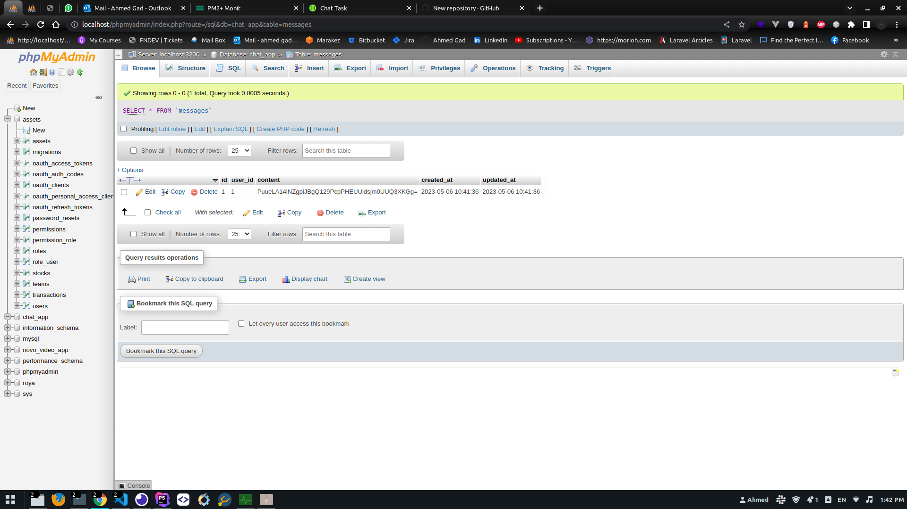
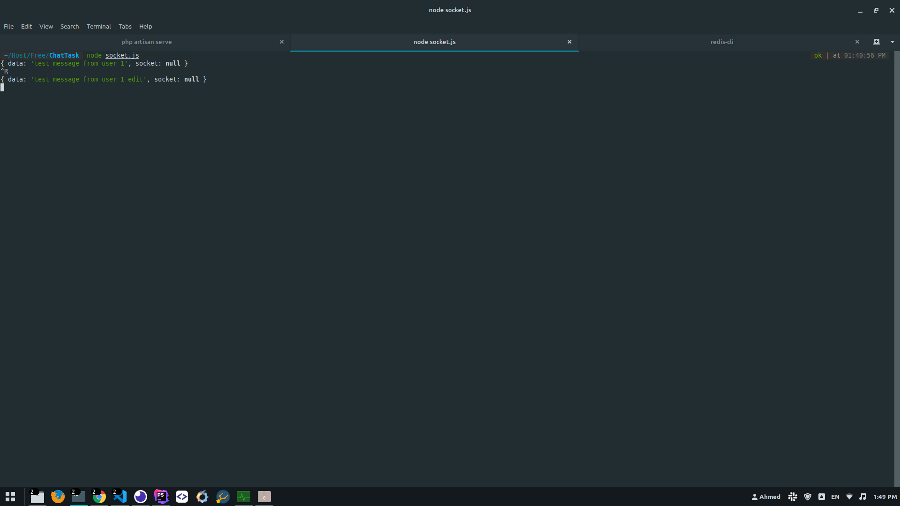

## Chat Task

Based on Laravel, Socket.io and Redis

### Setup
---
Clone the repo and follow below steps.
1. Run `composer install`
2. Copy `.env.example` to `.env`
3. Set valid database credentials of env variables `DB_DATABASE`, `DB_USERNAME`, and `DB_PASSWORD`
4. Run `php artisan key:generate` to generate application key
5. Run `php artisan migrate --seed` to seed your database
6. Set `BROADCAST_DRIVER=redis`
7. Add `CHAT_CONTENT_KEY` to `.env` 

That's it...
Run the command `php artisan serve`
Run the command `node socket.js` or `pm2 start socket.js` to start socket server
Open your server `/api/v1` For Api Documentation
Can copy `host_url/docs/api-docs.json` to import collection from swagger to postman like `http://127.0.0.1:8000/docs/api-docs.json`

### Demo Credentials
---

**Phone:** 01020304050\
**Password:** password1

**Phone:** 01030405060\
**Password:** password2

## ScreenShots
## API Documentation

## Database

## Socket

